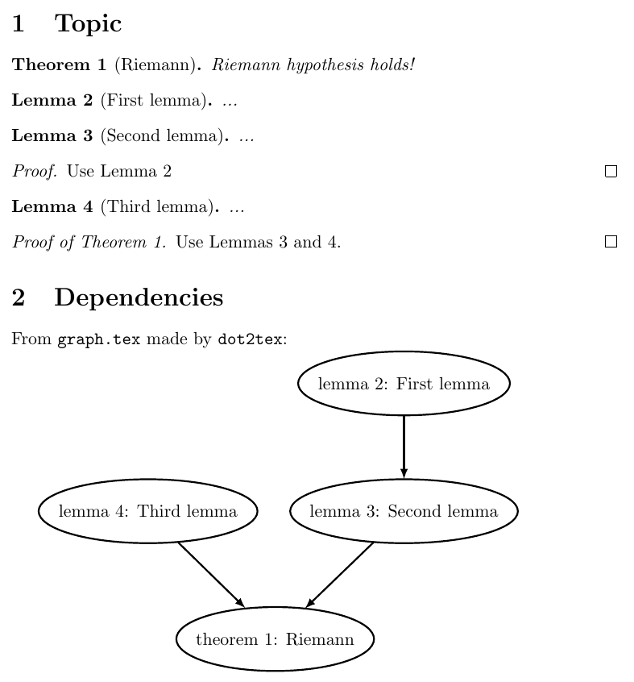

# Usage #

## TL;DR instructions

Edit or replace `main.tex`, then run `make`. Good luck!

## Step by step instructions

Create a file input.txt containing what you want to be read as 
* theorem environments (under Theorems)
* proof environments (under Proofs)
* labels (under Labels)
* references (under Refs)
* files to be read, relative or absolute path (under Files)
* aux file, under Aux - this is important for it to be able to know the number of theorems (so compile the LaTeX file first)
For a sample, see standard.tex.

In the below, we will write thm, proof, label, and ref to stand in for any word in one of the 4 lists above.

Note that the program cannot read "\input..." so if your file main.tex inputs ch1.tex, ch2.tex, and ch3.tex, you should list ch1.tex, ch2.tex, and ch3.tex under Files.

Run

    ./depgraph input.txt output.dot
    dot.exe -Tpdf output.dot > output.pdf

to make the pdf. (You must have dot installed: http://www.graphviz.org/ - make sure `dot` is on your file path.)
See the Graphviz documentation for alternate options in making the graph from the dot file.

For convenience, the above two lines are in the `Makefile`.

# What it does #

Depgraph reads the files in order.

* For each theorem, it creates a node. If you write

        \begin{thm}[Theorem 1]\label{thm:1} ...  \end{thm} 

then depgraph creates a node, internally labeled as thm:1, showing up as "Theorem 1" in the diagram.

* It searches for

        \begin{proof}...\end{proof} 
after each theorem (where "proof" is given by one of the Proof environments). Inside the proof it searches for

        \ref{prevlabel}
and then draws an edge from the node of prevlabel to this theorem's node. If you write

        \begin{proof}[...\ref{thm:1}]
then depgraph assumes you are proving thm:1, no matter what theorem came before. This overrides the default behavior (see previous bullet).

Note depgraph does not use a full-power LaTeX parser, so many things can confuse it.

If you want theorems to not show up or be referenced, then in LaTeX define alternate versions of thm, ref, etc. that do the same thing, and don't add them to input.txt.

# Todo #

Smart parsing
* Have the program parse "\input{...}" directly so that listing files is unnecessary.
* Automatically link up "corollaries" to the theorem immediately before.

Display
* Combine with dot2tex to allow it to display math.
* Integrate with D3 visualization as in the Stacks Project.
* Allow alternate proofs of theorems by displaying edges corresponding to different proofs with different colors/styles.
* Allow edge labels.

More options
* In a file with multiple sections/chapters, group together the theorems in each section/chapter, and have an option for drawing the graph for a specific set of sections/chapters.
* Create an automatic process to make dependency graphs for each section/chapter and put then in the respective sections/chapters, with hyperlinks to the theorems.
* Adapt the graph visualization to section dependencies (leitfaden).

See also http://thmlink.blogspot.com/
